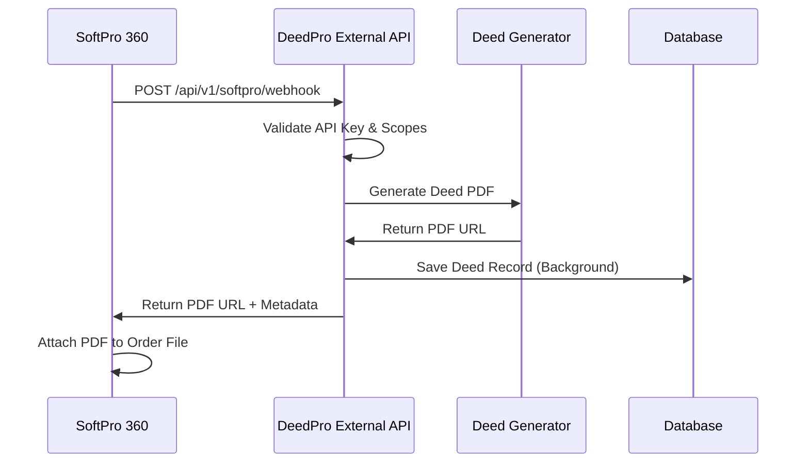

# DeedPro External Integrations API

**Enterprise-grade API for seamless integration with SoftPro 360, Qualia, and other title production software platforms.**

## 🎯 Overview

This API provides seamless bidirectional integration with major title and escrow software platforms, enabling automatic deed generation and document exchange without manual intervention.

### Key Features

- ✅ **SoftPro 360 Integration** - Webhook endpoints for Process Automation
- ✅ **Qualia GraphQL Integration** - Order import/export with document upload
- ✅ **Client-Level Authentication** - Secure API key management with scopes
- ✅ **Background Processing** - Non-blocking deed generation
- ✅ **Comprehensive Logging** - Full audit trail for integrations
- ✅ **Rate Limiting Ready** - Production-ready security measures

## 🚀 Quick Start

### Start the External API

```bash
# Option 1: Direct execution
cd backend
python external_api.py

# Option 2: Using startup script
python start_external_api.py

# Option 3: Manual uvicorn
uvicorn external_api:external_app --host 0.0.0.0 --port 8001 --reload
```

### Access Documentation

- **API Documentation**: http://localhost:8001/docs
- **ReDoc Documentation**: http://localhost:8001/redoc
- **Health Check**: http://localhost:8001/health

## 🔐 Authentication

The API uses client-level authentication with API keys and scopes:

### API Key Headers

```bash
X-API-Key: your_api_key_here
```

### Available Scopes

- `deed:create` - Generate new deeds
- `deed:read` - Read deed information
- `order:import` - Import orders from external platforms
- `document:upload` - Upload documents back to platforms

### Sample API Keys (Development)

```bash
# SoftPro Integration
X-API-Key: softpro_api_key_123

# Qualia Integration  
X-API-Key: qualia_api_key_456
```

## 🏢 Platform Integrations

### SoftPro 360 Integration

#### Webhook Setup in SoftPro

1. **Navigate to Process Automation** in SoftPro 360
2. **Create New Automation Rule**:
   - Trigger: Order status change or custom event
   - Action: Call Web Service
   - URL: `https://your-api-domain.com/api/v1/softpro/webhook`
   - Method: POST
   - Headers: `X-API-Key: softpro_api_key_123`

#### Data Flow

```
SoftPro Order Created → Automation Triggers → 
Webhook POST to DeedPro → Deed Generated → 
PDF URL Returned → SoftPro Attaches Document
```

#### Sample Payload

```json
{
  "order_id": "SP12345",
  "property_address": "123 Main St, Los Angeles, CA",
  "buyer_name": "John Doe",
  "seller_name": "Jane Smith",
  "deed_type": "Grant Deed",
  "escrow_number": "ESC001",
  "sales_price": 500000.00
}
```

### Qualia Integration

#### GraphQL Integration

1. **Obtain Qualia API Credentials** from your Qualia account
2. **Configure Environment Variables**:
   ```bash
   QUALIA_USERNAME=your_username
   QUALIA_PASSWORD=your_password
   ```

#### Import Order from Qualia

```bash
POST /api/v1/qualia/import-order
X-API-Key: qualia_api_key_456

{
  "order_id": "QA67890",
  "property_address": "456 Oak Ave, San Francisco, CA",
  "buyer": {"name": "Alice Johnson"},
  "seller": {"name": "Bob Wilson"}
}
```

#### Export Deed to Qualia

```bash
POST /api/v1/qualia/export-deed
X-API-Key: qualia_api_key_456

{
  "order_id": "QA67890",
  "deed_pdf_url": "https://api.deedpro.io/deeds/generated.pdf"
}
```

## 📋 API Endpoints

### Core Endpoints

| Method | Endpoint | Description |
|--------|----------|-------------|
| GET | `/health` | Health check |
| GET | `/api/v1/status` | API status with partner info |
| POST | `/api/v1/test-connection` | Test API key and connection |

### SoftPro Endpoints

| Method | Endpoint | Description |
|--------|----------|-------------|
| POST | `/api/v1/softpro/webhook` | Receive SoftPro order data |
| GET | `/api/v1/softpro/orders/{order_id}/deed` | Get deed by order ID |

### Qualia Endpoints

| Method | Endpoint | Description |
|--------|----------|-------------|
| POST | `/api/v1/qualia/import-order` | Import Qualia order |
| POST | `/api/v1/qualia/export-deed` | Export deed to Qualia |

### General Endpoints

| Method | Endpoint | Description |
|--------|----------|-------------|
| GET | `/api/v1/deeds` | List all deeds |
| GET | `/api/v1/keys/info` | Get API key information |

## 🔧 Integration Examples

### SoftPro Automation Setup

```javascript
// SoftPro Process Automation Script
const orderData = {
    order_id: "${ORDER_ID}",
    property_address: "${PROPERTY_ADDRESS}",
    buyer_name: "${BUYER_NAME}",
    seller_name: "${SELLER_NAME}",
    deed_type: "Grant Deed"
};

// HTTP POST to DeedPro
fetch("https://your-api.com/api/v1/softpro/webhook", {
    method: "POST",
    headers: {
        "Content-Type": "application/json",
        "X-API-Key": "softpro_api_key_123"
    },
    body: JSON.stringify(orderData)
});
```

### cURL Examples

```bash
# Test Connection
curl -X POST "http://localhost:8001/api/v1/test-connection" \
  -H "X-API-Key: softpro_api_key_123"

# SoftPro Webhook
curl -X POST "http://localhost:8001/api/v1/softpro/webhook" \
  -H "X-API-Key: softpro_api_key_123" \
  -H "Content-Type: application/json" \
  -d '{
    "order_id": "SP12345",
    "property_address": "123 Main St, Los Angeles, CA",
    "buyer_name": "John Doe",
    "seller_name": "Jane Smith",
    "deed_type": "Grant Deed"
  }'

# List Deeds
curl -X GET "http://localhost:8001/api/v1/deeds?platform=softpro" \
  -H "X-API-Key: softpro_api_key_123"
```

## 🔒 Security Considerations

### Production Security

1. **Use HTTPS Only** - Never expose API over HTTP in production
2. **IP Whitelisting** - Restrict access to known SoftPro/Qualia IPs
3. **Rate Limiting** - Implement rate limiting per API key
4. **API Key Rotation** - Regular rotation of API keys
5. **Audit Logging** - Log all API access for compliance

### Environment Variables

```bash
# Required for production
EXTERNAL_API_SECRET_KEY=your_very_secure_secret_key
QUALIA_USERNAME=your_qualia_username
QUALIA_PASSWORD=your_qualia_password
ALLOWED_ORIGINS=https://softpro.com,https://qualia.com
API_RATE_LIMIT=100
LOG_LEVEL=INFO
```

## 🚀 Deployment

### Deploy to Render

1. **Create New Web Service** on Render
2. **Connect Your Repository**
3. **Set Build Command**: `pip install -r backend/external_requirements.txt`
4. **Set Start Command**: `python backend/start_external_api.py`
5. **Add Environment Variables**
6. **Deploy**

### Production URL Structure

```
https://api-external.deedpro.io/api/v1/softpro/webhook
https://api-external.deedpro.io/api/v1/qualia/import-order
```

## 📊 Monitoring & Analytics

### Built-in Logging

The API provides comprehensive logging for:

- API key authentication events
- Webhook receipts and processing
- Deed generation requests
- Error tracking and debugging
- Performance metrics

### Health Monitoring

```bash
# Health Check
GET /health

# API Status
GET /api/v1/status
```

## 🤝 Getting Partner Access

### SoftPro 360 Partnership

1. **Apply**: https://www.softprocorp.com/become-a-partner/
2. **Contact Support**: support@softprocorp.com (mention you're a current user)
3. **Developer Resources**: https://devforum.softprocorp.com

### Qualia API Access

1. **Contact**: https://qualia.com/contact
2. **API Terms**: https://qualia.com/api-terms
3. **Email**: api@qualia.com

## 🔄 Integration Flow



## 📞 Support

For integration support and questions:

- **Documentation Issues**: Check this README and API docs
- **Authentication Problems**: Verify API keys and scopes
- **SoftPro Integration**: Consult SoftPro developer forum
- **Qualia Integration**: Contact Qualia API support

---

**⚠️ Important**: This external API runs independently from your main DeedPro API and will not affect any existing functionality, payments, or user management systems. 