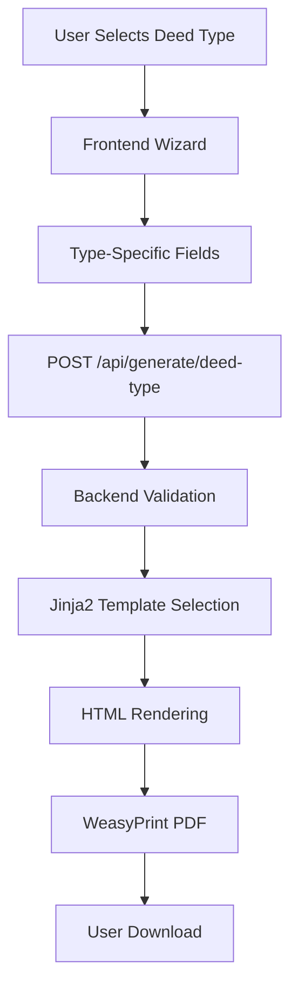

# 📚 Adding New Deed Types to DeedPro Wizard

**Purpose**: Complete step-by-step guide for adding new deed types to the DeedPro platform  
**Last Updated**: October 9, 2025  
**Based On**: Phase 5 Wizard Rebuild (Pixel-Perfect PDF System)  
**Difficulty**: Medium (3-6 hours per deed type)

---

## 🎯 **OVERVIEW**

The DeedPro wizard uses a **template-based system** where adding a new deed type requires coordinated changes across:
1. **Frontend** - Wizard UI and type selection
2. **Backend** - API endpoints and validation
3. **Templates** - Jinja2 HTML templates
4. **Database** - Optional schema updates

**Current Supported Types**:
- ✅ **Grant Deed** (California) - Fully implemented, pixel-perfect
- ⏳ **Quitclaim Deed** - Stub exists, needs template
- ⏳ **Interspousal Transfer** - Stub exists, needs template
- ⏳ **Warranty Deed** - Stub exists, needs template
- ⏳ **Tax Deed** - Stub exists, needs template

---

## 📊 **SYSTEM ARCHITECTURE FOR DEED TYPES**

### **How Deed Types Flow Through The System**



### **Key Components**

| Component | Purpose | Location |
|-----------|---------|----------|
| **Type Registry** | Lists available deed types | `backend/api/generate_deed.py` line 57 |
| **Validation Rules** | Required fields per type | `backend/api/generate_deed.py` line 140 |
| **Templates** | HTML/CSS for each type | `templates/<deed_type>/` |
| **API Endpoints** | Type-specific generation | `backend/routers/deeds.py` |
| **Frontend Wizard** | UI for data collection | `frontend/src/app/create-deed/<type>/` |
| **Models** | Pydantic validation | `backend/models/<type>.py` |

---

## 🛠️ **STEP-BY-STEP GUIDE**

### **Prerequisites**

Before starting, ensure you have:
- ✅ Legal expertise for the deed type (or access to legal templates)
- ✅ County-specific requirements documented
- ✅ Sample deed to model from
- ✅ Understanding of required vs optional fields
- ✅ Dev environment set up (`backend/` and `frontend/`)

---

## **STEP 1: Backend - Add Deed Type to Registry** (15 min)

### **File**: `backend/api/generate_deed.py`

### **1.1 - Add to Template Mapping**

```python
# Line 57-64
template_mapping = {
    'grant_deed': 'grant_deed_template.html',
    'quit_claim': 'quitclaim_deed_template.html',
    'interspousal_transfer': 'interspousal_transfer_template.html',
    'warranty_deed': 'warranty_deed_template.html',
    'tax_deed': 'tax_deed_template.html',
    'property_profile': 'property_profile_template.html',
    # ADD YOUR NEW TYPE HERE:
    'trust_transfer': 'trust_transfer_template.html',  # ← NEW
}
```

### **1.2 - Add Validation Rules**

```python
# Line 140-147
required_fields = {
    'grant_deed': ['grantorName', 'granteeName', 'propertySearch'],
    'quit_claim': ['grantorName', 'granteeName', 'propertySearch'],
    # ... existing types ...
    # ADD YOUR NEW TYPE HERE:
    'trust_transfer': ['trustName', 'trustees', 'beneficiaries', 'propertySearch'],  # ← NEW
}
```

### **1.3 - Add Type-Specific Data Preparation** (if needed)

```python
# Line 130-135
def prepare_template_data(request: GenerateDeedRequest) -> Dict[str, Any]:
    # ... existing preparation ...
    
    # ADD TYPE-SPECIFIC LOGIC:
    if request.deedType == 'trust_transfer':
        data['transfer_type'] = 'Trust Transfer'
        data['trust_statement'] = "This transfer is to a revocable living trust."
        # Format trustees
        if isinstance(data.get('trustees'), list):
            data['trustees_text'] = ', '.join(data['trustees'])
    
    return data
```

---

## **STEP 2: Backend - Create Pydantic Model** (30 min)

### **File**: `backend/models/<deed_type>.py` (NEW FILE)

### **2.1 - Create Model Class**

**Example**: `backend/models/trust_transfer.py`

```python
from pydantic import BaseModel, Field, validator
from typing import Optional, List
from datetime import date

class TrustTransferContext(BaseModel):
    """
    Pydantic model for Trust Transfer Deed rendering context.
    Validates all required fields before PDF generation.
    """
    
    # Trust Information
    trust_name: str = Field(..., min_length=1, description="Full legal name of trust")
    trustees: List[str] = Field(..., min_length=1, description="List of trustee names")
    trust_date: date = Field(..., description="Date trust was established")
    
    # Property Information
    apn: str = Field(..., min_length=5, description="Assessor's Parcel Number")
    county: str = Field(..., min_length=1, description="County name")
    legal_description: str = Field(..., min_length=10, description="Full legal description")
    property_address: str = Field(..., min_length=5, description="Property street address")
    
    # Transfer Details
    grantors_text: str = Field(..., description="Formatted grantor names")
    consideration: str = Field(default="", description="Consideration amount")
    execution_date: date = Field(..., description="Date of execution")
    
    # Document Information
    requested_by: str = Field(..., description="Escrow officer or preparer")
    title_company: Optional[str] = Field(None, description="Title company name")
    escrow_no: Optional[str] = Field(None, description="Escrow number")
    
    # Return Address
    return_to: dict = Field(..., description="Recording return address")
    
    @validator('trustees')
    def validate_trustees(cls, v):
        """Ensure at least one trustee"""
        if not v or len(v) == 0:
            raise ValueError("At least one trustee is required")
        return v
    
    @validator('trust_name')
    def validate_trust_name(cls, v):
        """Ensure trust name contains key words"""
        v_lower = v.lower()
        if 'trust' not in v_lower:
            raise ValueError("Trust name should contain the word 'trust'")
        return v
    
    class Config:
        json_schema_extra = {
            "example": {
                "trust_name": "The John Doe Family Trust",
                "trustees": ["John Doe", "Jane Doe"],
                "trust_date": "2020-01-15",
                "apn": "5123-456-789",
                "county": "Los Angeles",
                "legal_description": "Lot 5, Block 2 of Tract 12345...",
                "property_address": "123 Main St, Los Angeles, CA 90012",
                "grantors_text": "JOHN DOE AND JANE DOE, HUSBAND AND WIFE",
                "consideration": "10.00",
                "execution_date": "2025-10-09",
                "requested_by": "John Smith, Escrow Officer",
                "title_company": "First American Title",
                "escrow_no": "ESC-2025-001",
                "return_to": {
                    "name": "John Smith",
                    "company": "ABC Escrow",
                    "address1": "123 Title Way",
                    "city": "Los Angeles",
                    "state": "CA",
                    "zip": "90012"
                }
            }
        }
```

---

## **STEP 3: Backend - Create API Endpoint** (1 hour)

### **File**: `backend/routers/deeds.py`

### **3.1 - Import the Model**

```python
# Top of file
from models.grant_deed import GrantDeedRenderContext
from models.grant_deed_pixel import GrantDeedPixelContext
from models.trust_transfer import TrustTransferContext  # ← ADD THIS
```

### **3.2 - Create Endpoint**

```python
@router.post("/trust-transfer-ca", response_class=StreamingResponse)
async def generate_trust_transfer_ca(
    ctx: TrustTransferContext,
    user_id: str = Depends(get_current_user_id)
):
    """
    Generate Trust Transfer Deed (California) as PDF.
    
    Requirements:
    - Trust must be valid revocable living trust
    - Property must be in California
    - Proper trustee authorization
    """
    start_time = time.time()
    request_id = f"trust_transfer_{user_id}_{int(start_time)}"
    
    logger.info(f"[{request_id}] Trust Transfer deed generation started for user {user_id}")
    
    try:
        # Render Jinja2 template
        template = env.get_template("trust_transfer_ca/index.jinja2")
        html_content = template.render(ctx.dict())
        
        # Generate PDF
        from pdf_engine import render_html_to_pdf
        pdf_bytes = render_html_to_pdf(html_content, engine="weasyprint")
        
        # Create response
        pdf_stream = io.BytesIO(pdf_bytes)
        pdf_stream.seek(0)
        
        duration = time.time() - start_time
        logger.info(f"[{request_id}] Trust Transfer deed generated successfully in {duration:.2f}s")
        
        return StreamingResponse(
            pdf_stream,
            media_type="application/pdf",
            headers={
                "Content-Disposition": f'attachment; filename="trust_transfer_deed_{request_id}.pdf"'
            }
        )
        
    except ValidationError as e:
        logger.error(f"[{request_id}] Validation error: {e}")
        raise HTTPException(status_code=400, detail=f"Validation failed: {str(e)}")
    except Exception as e:
        logger.error(f"[{request_id}] Generation error: {e}")
        raise HTTPException(status_code=500, detail=f"PDF generation failed: {str(e)}")
```

---

## **STEP 4: Templates - Create HTML/CSS Template** (2-4 hours)

### **Directory**: `templates/trust_transfer_ca/`

### **4.1 - Create Directory Structure**

```bash
mkdir -p templates/trust_transfer_ca
touch templates/trust_transfer_ca/index.jinja2
touch templates/trust_transfer_ca/trust_transfer.css
```

### **4.2 - Create Base Template** (`index.jinja2`)

```jinja2
<!DOCTYPE html>
<html lang="en">
<head>
    <meta charset="UTF-8">
    <title>Trust Transfer Deed</title>
    <link rel="stylesheet" href="trust_transfer.css">
    <style>
        @page {
            size: letter;
            margin: 1in 1in 1in 1in;
        }
        body {
            font-family: 'Times New Roman', serif;
            font-size: 12pt;
            line-height: 1.5;
        }
    </style>
</head>
<body>
    <div class="deed-container">
        <!-- Recording Information (Top Right) -->
        <div class="recording-section">
            <p><strong>When Recorded Mail To:</strong></p>
            <p>{{ return_to.name }}</p>
            <p>{{ return_to.company }}</p>
            <p>{{ return_to.address1 }}</p>
            <p>{{ return_to.city }}, {{ return_to.state }} {{ return_to.zip }}</p>
        </div>
        
        <!-- APN and Escrow Info -->
        <div class="reference-section">
            <p><strong>APN:</strong> {{ apn }}</p>
            <p><strong>Escrow No:</strong> {{ escrow_no }}</p>
        </div>
        
        <!-- Title -->
        <h1 class="deed-title">TRUST TRANSFER DEED</h1>
        
        <!-- Grantor Section -->
        <div class="party-section">
            <p><strong>GRANTOR:</strong></p>
            <p class="party-name">{{ grantors_text }}</p>
        </div>
        
        <!-- Grantee Section (Trust) -->
        <div class="party-section">
            <p><strong>GRANTEE:</strong></p>
            <p class="party-name">{{ trust_name }}</p>
            <p class="trust-info">
                Dated {{ trust_date.strftime('%B %d, %Y') }}
            </p>
            <p class="trustees-info">
                <strong>Trustees:</strong> {{ trustees|join(', ') }}
            </p>
        </div>
        
        <!-- Consideration -->
        <div class="consideration-section">
            <p>FOR A VALUABLE CONSIDERATION, receipt of which is hereby acknowledged,</p>
        </div>
        
        <!-- Granting Clause -->
        <div class="granting-clause">
            <p>
                <strong>{{ grantors_text }}</strong> hereby GRANT(S) to 
                <strong>{{ trust_name }}</strong>, as Trustee(s),
            </p>
        </div>
        
        <!-- Property Description -->
        <div class="property-section">
            <p><strong>The real property in the County of {{ county }}, State of California, described as:</strong></p>
            <div class="legal-description">
                {{ legal_description }}
            </div>
            <p class="property-address">
                <strong>Commonly known as:</strong> {{ property_address }}
            </p>
        </div>
        
        <!-- Trust Statement -->
        <div class="trust-statement">
            <p>
                This transfer is made for the purpose of conveying title to the above-described 
                real property to the trustees of {{ trust_name }}, to be held, managed, and 
                distributed in accordance with the terms of said trust.
            </p>
        </div>
        
        <!-- Execution -->
        <div class="execution-section">
            <p>Dated: {{ execution_date.strftime('%B %d, %Y') }}</p>
            <div class="signature-block">
                <div class="signature-line"></div>
                <p class="signature-label">Grantor Signature</p>
            </div>
        </div>
        
        <!-- Notary Section -->
        <div class="notary-section">
            <p><strong>NOTARY ACKNOWLEDGMENT</strong></p>
            <p><em>(To be completed by Notary Public)</em></p>
            <div class="notary-placeholder">
                [Notary acknowledgment text per California Civil Code §1189]
            </div>
        </div>
    </div>
</body>
</html>
```

### **4.3 - Create Stylesheet** (`trust_transfer.css`)

```css
/* Trust Transfer Deed Stylesheet */

.deed-container {
    max-width: 7.5in;
    margin: 0 auto;
}

.recording-section {
    text-align: right;
    margin-bottom: 1in;
    font-size: 10pt;
}

.reference-section {
    margin-bottom: 0.5in;
    font-size: 10pt;
}

.deed-title {
    text-align: center;
    font-size: 16pt;
    font-weight: bold;
    margin: 0.5in 0;
    text-decoration: underline;
}

.party-section {
    margin: 0.25in 0;
}

.party-name {
    margin-left: 0.5in;
    font-weight: bold;
}

.trust-info, .trustees-info {
    margin-left: 0.5in;
    font-size: 11pt;
}

.granting-clause {
    margin: 0.25in 0;
    text-indent: 0.5in;
}

.property-section {
    margin: 0.25in 0;
}

.legal-description {
    margin: 0.25in 0.5in;
    text-align: justify;
    border-left: 2px solid #ccc;
    padding-left: 0.25in;
}

.trust-statement {
    margin: 0.25in 0;
    text-align: justify;
}

.execution-section {
    margin-top: 0.5in;
}

.signature-block {
    margin: 0.5in 0;
}

.signature-line {
    width: 3in;
    border-bottom: 1px solid #000;
    margin-bottom: 0.1in;
}

.signature-label {
    font-size: 10pt;
}

.notary-section {
    margin-top: 1in;
    border: 1px solid #000;
    padding: 0.25in;
}

.notary-placeholder {
    min-height: 2in;
    background-color: #f5f5f5;
    padding: 0.25in;
}
```

---

## **STEP 5: Frontend - Create Wizard Page** (2-3 hours)

### **Directory**: `frontend/src/app/create-deed/trust-transfer/`

### **5.1 - Create Page Component**

**File**: `frontend/src/app/create-deed/trust-transfer/page.tsx`

```typescript
'use client';

import { useState, useEffect } from 'react';
import { useRouter } from 'next/navigation';

interface TrustTransferData {
  // Trust Information
  trust_name: string;
  trustees: string[];
  trust_date: string;
  
  // Property Information
  apn: string;
  county: string;
  legal_description: string;
  property_address: string;
  
  // Transfer Details
  grantors_text: string;
  consideration: string;
  execution_date: string;
  
  // Document Info
  requested_by: string;
  title_company: string;
  escrow_no: string;
  
  // Return Address
  return_to: {
    name: string;
    company: string;
    address1: string;
    city: string;
    state: string;
    zip: string;
  };
}

export default function TrustTransferDeed() {
  const router = useRouter();
  const [currentStep, setCurrentStep] = useState(1);
  const [deedData, setDeedData] = useState<TrustTransferData>({
    trust_name: '',
    trustees: [''],
    trust_date: '',
    apn: '',
    county: '',
    legal_description: '',
    property_address: '',
    grantors_text: '',
    consideration: '',
    execution_date: new Date().toISOString().split('T')[0],
    requested_by: '',
    title_company: '',
    escrow_no: '',
    return_to: {
      name: '',
      company: '',
      address1: '',
      city: '',
      state: 'CA',
      zip: ''
    }
  });
  
  const [isGenerating, setIsGenerating] = useState(false);
  const [error, setError] = useState('');
  
  // Auto-save to localStorage
  useEffect(() => {
    const saved = localStorage.getItem('trust-transfer-draft');
    if (saved) {
      setDeedData(JSON.parse(saved));
    }
  }, []);
  
  useEffect(() => {
    localStorage.setItem('trust-transfer-draft', JSON.stringify(deedData));
  }, [deedData]);
  
  const handleFieldChange = (field: string, value: any) => {
    setDeedData(prev => ({
      ...prev,
      [field]: value
    }));
  };
  
  const addTrustee = () => {
    setDeedData(prev => ({
      ...prev,
      trustees: [...prev.trustees, '']
    }));
  };
  
  const updateTrustee = (index: number, value: string) => {
    const newTrustees = [...deedData.trustees];
    newTrustees[index] = value;
    setDeedData(prev => ({
      ...prev,
      trustees: newTrustees
    }));
  };
  
  const removeTrustee = (index: number) => {
    setDeedData(prev => ({
      ...prev,
      trustees: prev.trustees.filter((_, i) => i !== index)
    }));
  };
  
  const generatePDF = async () => {
    setIsGenerating(true);
    setError('');
    
    try {
      const token = localStorage.getItem('token');
      
      const response = await fetch('/api/generate/trust-transfer-ca', {
        method: 'POST',
        headers: {
          'Content-Type': 'application/json',
          'Authorization': `Bearer ${token}`
        },
        body: JSON.stringify(deedData)
      });
      
      if (!response.ok) {
        const errorData = await response.json();
        throw new Error(errorData.detail || 'Failed to generate PDF');
      }
      
      // Download PDF
      const blob = await response.blob();
      const url = window.URL.createObjectURL(blob);
      const a = document.createElement('a');
      a.href = url;
      a.download = `trust_transfer_deed_${Date.now()}.pdf`;
      document.body.appendChild(a);
      a.click();
      window.URL.revokeObjectURL(url);
      document.body.removeChild(a);
      
      // Clear draft
      localStorage.removeItem('trust-transfer-draft');
      
      // Redirect to success page
      router.push('/past-deeds?success=trust-transfer');
      
    } catch (err: any) {
      setError(err.message || 'Failed to generate PDF');
    } finally {
      setIsGenerating(false);
    }
  };
  
  return (
    <div className="wizard-container">
      <h1>Trust Transfer Deed - California</h1>
      
      {/* Step 1: Trust Information */}
      {currentStep === 1 && (
        <div className="step-content">
          <h2>Step 1: Trust Information</h2>
          
          <div className="form-group">
            <label>Trust Name *</label>
            <input
              type="text"
              value={deedData.trust_name}
              onChange={(e) => handleFieldChange('trust_name', e.target.value)}
              placeholder="The John Doe Family Trust"
            />
          </div>
          
          <div className="form-group">
            <label>Trust Date *</label>
            <input
              type="date"
              value={deedData.trust_date}
              onChange={(e) => handleFieldChange('trust_date', e.target.value)}
            />
          </div>
          
          <div className="form-group">
            <label>Trustees *</label>
            {deedData.trustees.map((trustee, index) => (
              <div key={index} className="trustee-input">
                <input
                  type="text"
                  value={trustee}
                  onChange={(e) => updateTrustee(index, e.target.value)}
                  placeholder="Trustee Name"
                />
                {deedData.trustees.length > 1 && (
                  <button onClick={() => removeTrustee(index)}>Remove</button>
                )}
              </div>
            ))}
            <button onClick={addTrustee}>+ Add Trustee</button>
          </div>
          
          <button onClick={() => setCurrentStep(2)}>Next</button>
        </div>
      )}
      
      {/* Step 2: Property Information */}
      {currentStep === 2 && (
        <div className="step-content">
          {/* Property form fields... */}
          <button onClick={() => setCurrentStep(1)}>Back</button>
          <button onClick={() => setCurrentStep(3)}>Next</button>
        </div>
      )}
      
      {/* Step 3: Preview & Generate */}
      {currentStep === 3 && (
        <div className="step-content">
          <h2>Step 3: Review & Generate</h2>
          {/* Preview... */}
          <button onClick={generatePDF} disabled={isGenerating}>
            {isGenerating ? 'Generating...' : 'Generate PDF'}
          </button>
          {error && <div className="error">{error}</div>}
        </div>
      )}
    </div>
  );
}
```

---

## **STEP 6: Frontend - Create API Route** (15 min)

### **File**: `frontend/src/app/api/generate/trust-transfer-ca/route.ts` (NEW)

```typescript
import { NextRequest, NextResponse } from 'next/server';

export async function POST(req: NextRequest) {
  try {
    const body = await req.json();
    
    // Forward to backend
    const authHeader = req.headers.get('authorization');
    const headers: Record<string, string> = {
      'Content-Type': 'application/json'
    };
    if (authHeader) {
      headers['Authorization'] = authHeader;
    }
    
    const backendUrl = process.env.NEXT_PUBLIC_API_URL || 'http://localhost:8000';
    const response = await fetch(`${backendUrl}/api/generate/trust-transfer-ca`, {
      method: 'POST',
      headers,
      body: JSON.stringify(body)
    });
    
    if (!response.ok) {
      const error = await response.json();
      return NextResponse.json(error, { status: response.status });
    }
    
    // Stream PDF back to client
    const pdf = await response.blob();
    return new NextResponse(pdf, {
      headers: {
        'Content-Type': 'application/pdf',
        'Content-Disposition': response.headers.get('Content-Disposition') || 'attachment; filename="trust_transfer.pdf"'
      }
    });
    
  } catch (error: any) {
    return NextResponse.json(
      { detail: error.message || 'Internal server error' },
      { status: 500 }
    );
  }
}
```

---

## **STEP 7: Testing** (1 hour)

### **7.1 - Backend Testing**

```python
# Create test file: backend/tests/test_trust_transfer.py

import pytest
from fastapi.testclient import TestClient
from main import app

client = TestClient(app)

def test_trust_transfer_validation():
    """Test that validation catches missing required fields"""
    data = {
        "trust_name": "Test Trust",
        # Missing trustees - should fail
    }
    
    response = client.post("/api/generate/trust-transfer-ca", json=data)
    assert response.status_code == 400
    assert "trustees" in response.json()["detail"].lower()

def test_trust_transfer_success():
    """Test successful PDF generation"""
    data = {
        "trust_name": "The John Doe Family Trust",
        "trustees": ["John Doe", "Jane Doe"],
        "trust_date": "2020-01-15",
        "apn": "5123-456-789",
        "county": "Los Angeles",
        # ... complete data ...
    }
    
    response = client.post("/api/generate/trust-transfer-ca", json=data)
    assert response.status_code == 200
    assert response.headers["content-type"] == "application/pdf"
```

### **7.2 - Frontend Testing**

1. **Manual Testing**:
   - Navigate to `/create-deed/trust-transfer`
   - Fill out all fields
   - Test validation
   - Generate PDF
   - Verify PDF contents

2. **Check**:
   - ✅ Auto-save working
   - ✅ Validation errors display
   - ✅ PDF downloads
   - ✅ Draft clears after success
   - ✅ Redirect to past-deeds

---

## **STEP 8: Documentation** (30 min)

### **8.1 - Update README**

Add to `backend/README.md`:

```markdown
### Trust Transfer Deed

**Endpoint**: `POST /api/generate/trust-transfer-ca`

**Purpose**: Generate California Trust Transfer Deed for transferring property to a revocable living trust.

**Required Fields**:
- `trust_name` - Full legal name of trust
- `trustees` - Array of trustee names
- `trust_date` - Date trust was established
- `apn` - Assessor's Parcel Number
- `county` - County name
- `legal_description` - Full legal description
- `property_address` - Property street address
- `grantors_text` - Formatted grantor names
- `execution_date` - Date of execution
- `requested_by` - Escrow officer name
- `return_to` - Recording return address object

**Returns**: PDF binary stream

**Example**:
```bash
curl -X POST http://localhost:8000/api/generate/trust-transfer-ca \
  -H "Content-Type: application/json" \
  -H "Authorization: Bearer <token>" \
  -d @trust_transfer_example.json \
  --output trust_transfer.pdf
```
```

### **8.2 - Create Example JSON**

**File**: `backend/examples/trust_transfer_example.json`

```json
{
  "trust_name": "The John Doe Family Trust",
  "trustees": ["John Doe", "Jane Doe"],
  "trust_date": "2020-01-15",
  "apn": "5123-456-789",
  "county": "Los Angeles",
  "legal_description": "Lot 5, Block 2 of Tract 12345, as per map recorded in Book 123, Page 45 of Maps, in the Office of the County Recorder of Los Angeles County, State of California.",
  "property_address": "123 Main St, Los Angeles, CA 90012",
  "grantors_text": "JOHN DOE AND JANE DOE, HUSBAND AND WIFE AS JOINT TENANTS",
  "consideration": "10.00",
  "execution_date": "2025-10-09",
  "requested_by": "John Smith, Escrow Officer",
  "title_company": "First American Title",
  "escrow_no": "ESC-2025-001",
  "return_to": {
    "name": "John Smith",
    "company": "ABC Escrow",
    "address1": "123 Title Way",
    "city": "Los Angeles",
    "state": "CA",
    "zip": "90012"
  }
}
```

---

## **STEP 9: Deployment** (15 min)

### **9.1 - Commit Changes**

```bash
git add backend/models/trust_transfer.py
git add backend/routers/deeds.py
git add backend/api/generate_deed.py
git add templates/trust_transfer_ca/
git add frontend/src/app/create-deed/trust-transfer/
git add frontend/src/app/api/generate/trust-transfer-ca/

git commit -m "Add Trust Transfer Deed type - complete implementation"
git push origin main
```

### **9.2 - Verify Deployment**

1. **Backend** (Render):
   - Watch deployment logs
   - Check for errors
   - Test endpoint: `GET /docs` (should show new endpoint)

2. **Frontend** (Vercel):
   - Watch deployment logs
   - Navigate to `/create-deed/trust-transfer`
   - Test full workflow

---

## ✅ **COMPLETION CHECKLIST**

Before marking a new deed type as "complete", verify:

- [ ] Backend registry updated (`generate_deed.py`)
- [ ] Validation rules added
- [ ] Pydantic model created with examples
- [ ] API endpoint implemented in `routers/deeds.py`
- [ ] Jinja2 template created with proper styling
- [ ] Frontend wizard page created
- [ ] Frontend API proxy route created
- [ ] Backend tests written and passing
- [ ] Frontend manual testing complete
- [ ] Documentation updated (README, examples)
- [ ] Committed and pushed to `main`
- [ ] Backend deployed to Render
- [ ] Frontend deployed to Vercel
- [ ] End-to-end test in production
- [ ] PDF looks professional and legally compliant

---

## 🎯 **TIPS & BEST PRACTICES**

### **Legal Compliance**
- ✅ Consult with legal experts for deed wording
- ✅ Research county-specific requirements
- ✅ Include all legally required elements (grantors, grantees, property description, execution, notary)
- ✅ Follow California Civil Code requirements

### **Template Design**
- ✅ Use US Letter size (8.5" × 11")
- ✅ Standard 1" margins (adjustable for recording requirements)
- ✅ Times New Roman font, 12pt
- ✅ Clear section headings
- ✅ Proper spacing for notary stamps
- ✅ Recording box in top right

### **Validation**
- ✅ Validate all required fields
- ✅ Use Pydantic validators for complex rules
- ✅ Provide helpful error messages
- ✅ Test with invalid data

### **User Experience**
- ✅ Auto-save drafts to localStorage
- ✅ Clear progress indicators
- ✅ Inline validation feedback
- ✅ Preview before generation
- ✅ Download automatically
- ✅ Clear drafts after success

---

## 📊 **EFFORT SUMMARY**

| Step | Task | Time | Difficulty |
|------|------|------|------------|
| 1 | Backend Registry | 15 min | Easy |
| 2 | Pydantic Model | 30 min | Easy |
| 3 | API Endpoint | 1 hour | Medium |
| 4 | HTML/CSS Template | 2-4 hours | Hard |
| 5 | Frontend Wizard | 2-3 hours | Medium |
| 6 | API Proxy Route | 15 min | Easy |
| 7 | Testing | 1 hour | Medium |
| 8 | Documentation | 30 min | Easy |
| 9 | Deployment | 15 min | Easy |
| **TOTAL** | **8-11 hours** | **Medium** |

**Most Time-Consuming**: Template creation (Step 4)  
**Most Complex**: Legal compliance and styling  
**Easiest**: Registry updates (Steps 1, 6, 9)

---

## 🆘 **TROUBLESHOOTING**

### **Issue: PDF not generating**
- Check Render logs for Python errors
- Verify template path is correct
- Test template rendering separately

### **Issue: Validation failing**
- Check Pydantic model field names match frontend
- Verify all required fields are sent
- Test with example JSON

### **Issue: Styling doesn't match**
- Check CSS `@page` rules
- Verify font sizes and margins
- Test with different PDF viewers

### **Issue: Frontend not connecting**
- Verify API route is created
- Check Authorization header forwarding
- Test backend endpoint directly

---

## 📚 **REFERENCE**

- **Existing Grant Deed**: `templates/grant_deed_ca_pixel/index.jinja2`
- **PDF Generation System**: `docs/backend/PDF_GENERATION_SYSTEM.md`
- **Wizard Architecture**: `docs/wizard/ARCHITECTURE.md`
- **California Civil Code**: [leginfo.legislature.ca.gov](https://leginfo.legislature.ca.gov/)

---

**Status**: Production-ready guide  
**Last Tested**: Phase 5 (October 2025)  
**Next**: Use this guide to add Quitclaim, Interspousal Transfer, Warranty Deed types

---

**Questions?** Check `docs/DOCS_INDEX.md` or ask the team!

